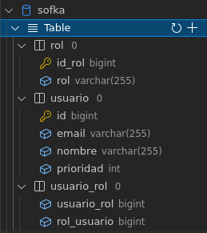
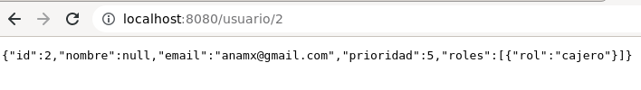
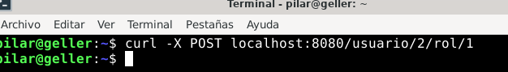
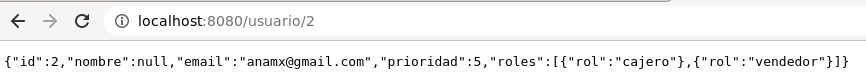
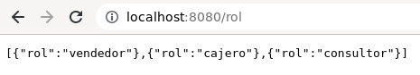
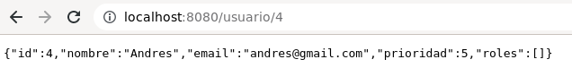
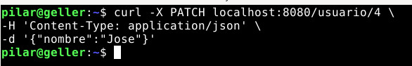
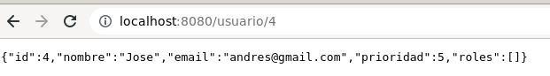
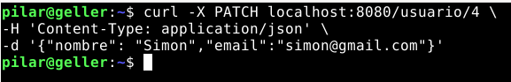
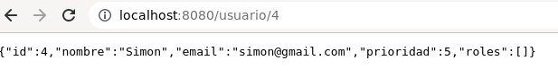

# demoCrudTEST

###1)Se aplica la relación @ManyToMany debido a que un usuario puede tener varios roles, de igual manera un rol puede tener varios usuarios.

### Para aplicar esta relación se crea una nueva tabla roles y una tabla que sirve de puente o conexión llamada usuario_rol, a continuación se presenta la estructura:

###Para agregar un rol a un usuario se ejecuta lo siguiente:
###El usuario con el id:2 tiene el siguiente registro actual ->

###A continuación se le agrega un nuevo rol de vendedor:

####A continuación se muestra usurio con id:2 actualizado ->

####Nota: en la tabla roles se tienen los siguientes roles registrados:

###2) A continuación se presenta un ejemplo aplicado para editar un usuario:

### El usuario con id:4 de la tabla usuarios tiene el siguiente registro ->

####Se quiere editar el nombre, para ello se aplica lo siguiente ->

####A continuación se muestra el usuario actualizado con id:4 ->

####Si se quiere editar el nombre y el correo del usuario con id:4 se aplica lo siguiente->

####Así queda registrado el usuario con id:4 actualizado:

